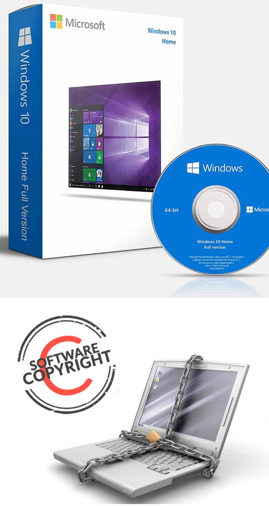
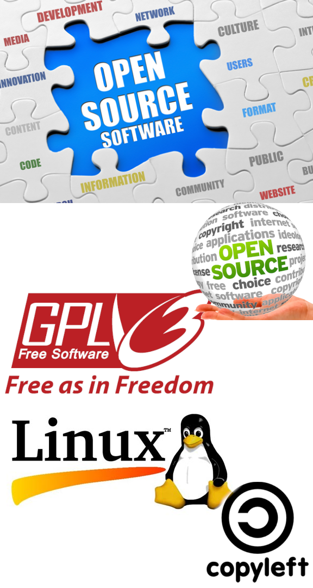
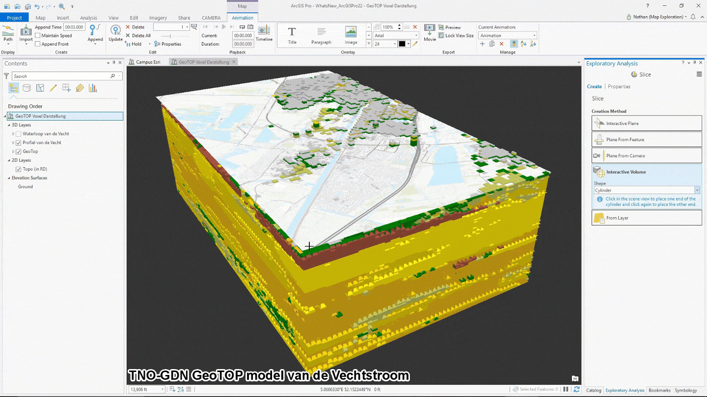
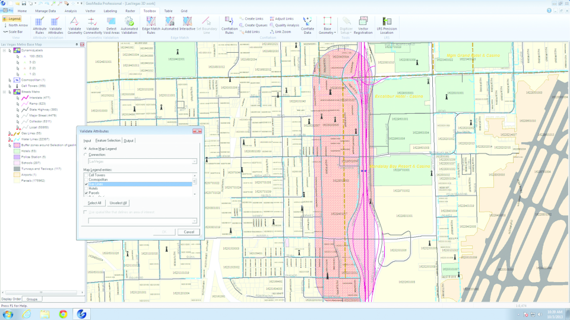
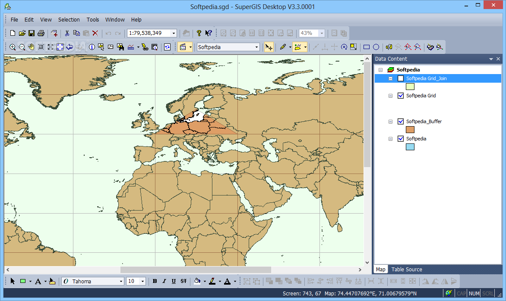
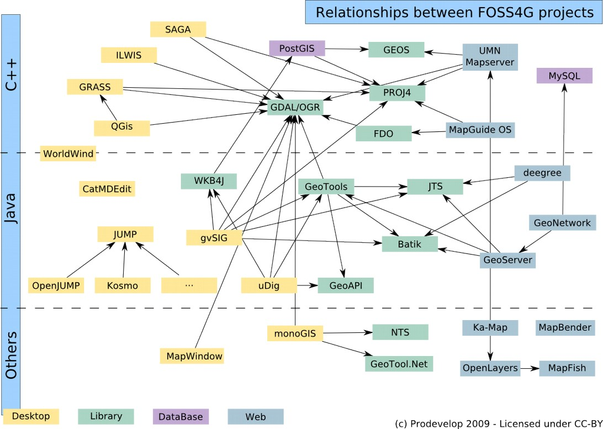
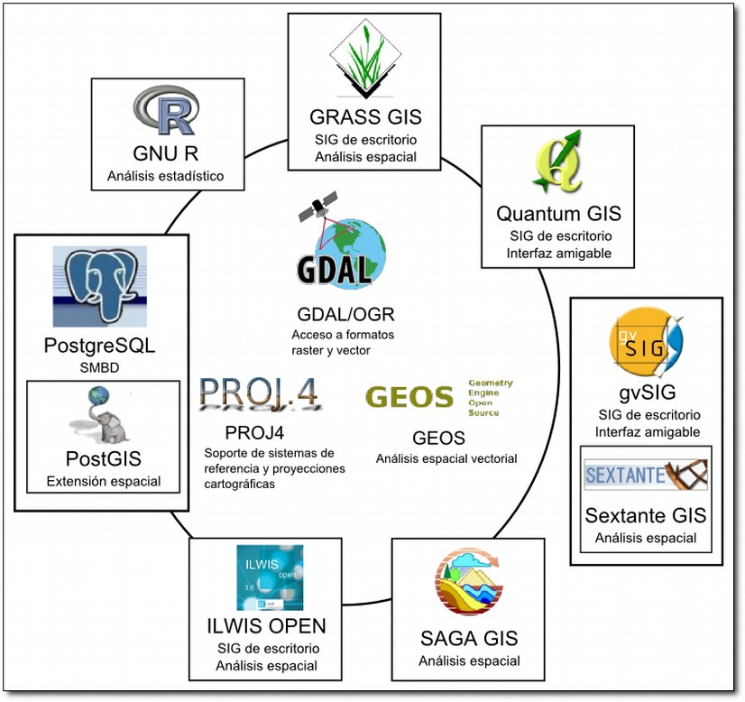

<!-- _paginate: false -->

# Herramientas SIG y fuentes de datos geográficos abiertos

</img>

</img>

Reconocimiento - Compartir Igual <a href="https://creativecommons.org/licenses/by-sa/4.0/legalcode">CC BY-SA</a>

<h3>Samuel Mesa</h3>
<small style="text-align:center;">femesagi@unal.edu.co</small>

Octubre de 2021 
Ingeniería Civil y Agrícola

---

# Contenido

- Características de un software SIG
- Herramientas SIG privativas y FOSS
- Fuentes de datos libres
    - Datos de imágenes satelitales
    - Datos de servicios geográficos WMS, WFS y WCS
    - Datos estadísticos
    - Datos de mapas libres de OSM

---

<!-- backgroundImage: "linear-gradient(to left, #614385, #516395)" -->
<!-- color: white -->

### Principales características de un software SIG

* Soporte de multiples formatos y fuentes: raster, vector, malla, bases de datos espaciales, geoservicios.
* Multiplataforma (colector, Desktop, Servidor)
* Herramientas de edición de los formatos, validación topológica 
* Despliegues en 2D, 3D, multitemporal.
* Generación y composición cartográfica profesional
* Soporte sistemas de referencia de coordenadas, definición, conversión y transformación.
* Soporte de un lenguaje de *scripts* (Python).

---

### Principales características de un software SIG

* Modelador de flujo de procesos. 
* Funciones de análisis espacial: redes, métricas del paisaje, terreno, hidrológico.
* Disponible la documentación del manual de usuario, desarrollador, algoritmos.
* Soporte técnico y una comunidad de usuarios dinámica.
* Integración con software de terceros: paquetes estadísticos, visor de mapas.

---

<!-- backgroundImage: "linear-gradient(to top, #67b8e3, #0288d1)" -->
<!-- color: white -->

# El mercado del software SIG

---

<!-- class: none -->

## Software privativo 

<small>
Basado en el <b>pago de licencias</b> (<b>limitada</b> a un número de equipos), y el producto es exclusivo a la empresa que desarrolla / comercializa el software. 

Tiene **restricciones** de acceso al código fuente, por lo tanto su modificación y contribución está prohibida, en muchos casos se limita la **redistribución** y **comercialización**. 

Fomenta el uso de **patentes** y usa un esquema de licenciamiento con  **Copyright**. Modelos de comercialización por versiones de software, paquetes (fragmentación de funcionalidades) y soporte.

</small>

---

##  Software Libre o de código abierto

Se accede de manera libre al software, no hay restricciones de uso, se puede modificar y contribuir al código fuente, documentación y mejoras del software. Usa un modelo de comercialización de soporte, desarrollo a la medida.

---

<!-- _class: none -->

<iframe width="100%" height="90%" src="https://www.youtube.com/embed/K-3q_W973Dw" title="YouTube video player" frameborder="0" allow="accelerometer; autoplay; clipboard-write; encrypted-media; gyroscope; picture-in-picture" allowfullscreen></iframe>

Comparativo ArcGIS vs QGIS

---

<!--  backgroundImage: none -->
<!--  color: none -->
<!--  class: lead -->

## Software SIG privativo

-  **ArcGIS**
    - Proveedor ESRI (EEUU): www.esri.com 
- **AutoCAD Map**
    - Proveedor AutoDesk (EEUU): http://usa.autodesk.com 
- **Geomedia**
    - Proveedor Hexagon (Europa): https://hexagon.com/
- **MapInfo**
    - Proveedor GeoBIS: http://www.geobis.com/  

---

# Software SIG privativo o “propietario”

- **IDRISI (TerrSet)**
    - Proveedor Universidad de Clark (EEUU):  http://www.clarklabs.org/ 
- **SuperGIS**
    - Proveedor SuperGeo (China): http://www.supergeotek.com  
- **SuperMap**
    - Proveedor SuperMap (China): http://www.supermap.com     

---

---

---

---

---

---

# Software SIG FOSS

---

---

---

# Software SIG FOSS

- **gvSIG**
    - Proveedor Inicialmente la Generalitat Valenciana (España), luego la Asociación gvSIG: http://www.gvsig.com 
- **QGIS**
    - Proveedor OSGeo: https://www.qgis.org 
- **GRASS GIS**
    - Proveedor OSGeo: http://grass.osgeo.org/  
- **ILWIS**
    - Proveedor ITC de Holando, 52°N: https://52north.org/ 

---

- **SAGA GIS**
    - Proveedor Unversidades alemanas, principalmente la Universidad de Göttingen: http://www.saga-gis.org 
- **MapWindow GIS – HidroSIG**
    - Proveedor Comunidad de Software Libre: https://www.mapwindow.org, https://www.medellin.unal.edu.co/~hidrosig 
- **SPRING GIS – TerraView**
    - Proveedor INPE de Brasil: Sitio Web: http://www.dpi.inpe.br/spring, http://www.dpi.inpe.br/terraview 